# Beam Search Explained — Experimenting with Beam Search for LLM Inference on Recommendation Systems

The majority of large-language models in production today are
autoregressive: they generate one token at a time, and each token is
conditioned on everything produced so far.
The model reads the full sequence, produces a probability distribution over
its vocabulary (typically ~150,000 tokens), commits to one token, and
repeats. There is no shortcut. Token 400 cannot exist until token 399 does.
Non-autoregressive LLMs do exist, mostly diffusion-based designs like LLaDA
and Mercury that refine an entire masked sequence in parallel, but they
remain the exception for real reasons: output quality still trails the
autoregressive frontier, the "parallel" decode needs dozens of refinement
passes that offsets the theoretical speedup, and the whole serving stack,
KV caching, continuous batching, streaming, is built around left-to-right
generation. So for the models you actually serve, the serial decoding
loop is a reality: prefill is parallel and cheap, decode is sequential and
memory-bandwidth-bound, and the bill scales with output token length.
Speculative decoding, where a small draft model proposes tokens that the
large model verifies in one parallel pass, is worth mentioning here: it makes
each serial step cheaper while leaving the dependency, and the output
distribution, untouched. How it interacts with beam search, and whether
the two can compose at all, is its own question; a deep dive on
speculative decoding is coming in a later post. 

Now
picture a recommendations endpoint, say a travel app where the user types
a paragraph about their trip and the model emits a few hundred tokens of
strict JSON containing the actions they can take next (book a hotel,
find flights, search experiences).
Greedy decoding gives you exactly one candidate. To show the user four
alternatives, batched `n=4` sampling produces them in a single call, but
at temperature a real fraction come back malformed: wrong shape, dropped
enum, truncated mid-list. Constrained decoding fixes the syntax and still
cannot promise the document finishes inside its token budget. The
interesting question is whether a smarter search strategy, one that keeps
several candidate sequences alive and scores them as complete sequences
instead of locking in each token as it goes, can do better than all of
this at once.

Beam search is the fifty-year-old answer to this problem. It was invented for
speech recognition in Bruce Lowerre's HARPY system at CMU in 1976, where the
decoder had to prune an astronomical hypothesis space down to the few
candidates worth expanding. The same algorithm then ran essentially unchanged
through phrase-based machine translation (Moses's stack decoding), OCR, and
parsing. When neural machine translation arrived in 2014, beam search simply
moved onto the decoder's softmax and kept working. What I find interesting is
the second act. After LLMs made sampling the default, beam search quietly
came back for structured generation. vLLM shipped it in **PR #7, March
2023**, one of the repository's first pull requests, then pulled it out of
the core during the 2024 refactor and re-landed it in **v0.6.3 (November
2024)** as a first-class `LLM.beam_search()` API plus an OpenAI-server flag,
where it has been getting steady perf attention since. This post digs into
how the algorithm actually works, what the vLLM implementation buys you, and
then (the part that surprised me) what a properly controlled benchmark on
a real travel-recommendations workload says beam search is actually worth.
Spoiler: beam search is not faster for most use cases we benchmarked, but it
has very real applications where outputs need to be consistent —
canonical-answer tasks like translation, extraction, and semantic
parsing — where, compared to vanilla greedy decoding, it gives a
measurably better answer (up to 2× execution accuracy on NL→SQL).

---

## 1. What is beam search?

Given a partially generated sequence, the model's job is just
`P(next_token | prefix)`. Three ways to use that distribution:

| Strategy | Rule at each step | Character |
|---|---|---|
| **Greedy** | take the argmax | deterministic; locally optimal, globally naive |
| **Sampling** | draw from the distribution (temp/top-p shaped) | diverse; stochastic; quality varies run to run |
| **Beam search** | track the `k` best *partial sequences* by cumulative logprob | approximates the most-likely **complete** sequence |

Greedy's failure is subtle: the best *next* token can lead to a bad
*sequence*. Once committed, there's no going back. Sampling's failure is the
opposite. It wanders into low-likelihood territory on purpose, which for
structured output means malformed JSON, off-enum values, or truncation.

Beam search is the middle path. Instead of committing to one hypothesis, it
keeps `k` of them, the **beam width**, ranked by the sum of logprobs so
far. Each step expands every live beam by every candidate token, re-ranks all
extensions globally, and keeps the top `k`. Beams that emit `<eos>` move to a
finished pile. The winner is the finished sequence with the best total score.

```python
# the entire algorithm — src/beam_search_scratch.py
beams = [((), 0.0)]                              # (tokens, cum_logprob)
for step in range(max_len):
    cands = [(t + (tok,), s + lp)
             for t, s in beams
             for tok, lp in logprobs(t).items()] # expand every beam
    cands.sort(key=score, reverse=True)
    beams = top_k(cands, k)                      # EOS'd → finished pile
return best(finished)
```

Vocabulary we will use:

- **beam width `k`** — how many hypotheses survive each step; `k=1` *is* greedy
- **cumulative logprob** — `Σ log P(tokenᵢ | prefix)`; only ever decreases,
  which creates a bias toward short sequences
- **length penalty** — divides score by `lenᵅ` (or GNMT's variant) to
  counter that bias
- **finished vs live** — `<eos>`-terminated hypotheses stop competing for
  beam slots but stay in the final ranking

It isn't a new idea. Beam search comes from speech recognition in the 1970s
and powered essentially all of machine translation until LLMs made sampling
fashionable. For *structured* LLM output, it's fashionable again.

## 2. The algorithm, step by step



*Animated walkthrough ([static frame](viz/beam_search_static.svg) if your
viewer doesn't animate SVG). Regenerate with `python viz/beam_animation.py`;
`--frame <seconds>` renders any single frame.*

The animation replays a rigged toy LM (`src/beam_search_scratch.py`, no
deps) where three first-token candidates compete. Read each root→leaf path
as one recommendation item, *verb → noun → when*, where `when` is ISO 8601
(a `YYYY-MM-DD` date or `YYYY-MM-DD/YYYY-MM-DD` interval) — the exact shape
the downstream API parses:

```
() ──"Visit"(-0.4)──"museum"(-3.0)──"2026-10-03"(-0.5)──<eos>                    total -3.9
  ├─"Book"(-0.6)───"flights"(-0.3)──"2026-06-12/2026-06-19"(-0.2)──<eos>        total -1.1  ★
  └─"Ask_About"(-1.2)───"local_customs"(-0.8)───"2026-04-01/2026-05-31"(-0.6)──<eos>  total -2.6
```

(A note on levels: the engine really does search at token level — the JSON
document is just a token stream and `Book` is one token among ~150k. Here we
draw the tree at item level, one node per field, because it is easier to see.
Same algorithm, coarser view.)

Reading the animation:

1. **Expand.** Each live beam proposes its next-token distribution. From the
   root: `Visit` (−0.4), `Book` (−0.6), `Ask_About` (−1.2).
2. **Rank and prune.** With `k=2`, `Ask_About` dies. A pruned branch *never* grows
   back. That is where the compute budget goes: only survivors expand.
3. **Expand the survivors.** `Visit` fans out to `…museum` (−3.4), `…beach`
   (−3.9); `Book` to `…flights` (−0.9), `…hotel` (−2.6).
4. **Rank again.** `Visit` won step 1 locally but is losing *cumulatively* —
   both `Book` continuations survive; `Visit`'s whole subtree is pruned.
5. **Finish.** Beams emit `<eos>` and move to the finished pile.
6. **Winner.** `Book flights 2026-06-12/2026-06-19` (−1.10), while greedy,
   which committed to `Visit` at step 1, ended at −3.90 with
   `Visit museum 2026-10-03`.

That's the whole trick: **delay commitment, compare whole sequences.** The
cost is `k`× the decode work per step; the payoff is escaping locally-greedy
dead ends.

Two honest caveats to hold onto for later: beams are *not* diverse (the top
`k` hypotheses are usually typographical variants of one answer), and
cumulative logprob *punishes length* (favoring thin outputs unless you add a
length penalty).

## 3. Beam search in vLLM

vLLM is the de-facto open-source serving engine for LLMs: PagedAttention KV
management, continuous batching, prefix caching, an offline `LLM` API and an
OpenAI-compatible server. Beam search is one of its oldest features, but the
API changed once, and the timeline is worth knowing because older tutorials
show the pre-0.6 interface.

| When | What happened |
|---|---|
| Mar 2023 | PR **#7** — "Support beam search & parallel generation", one of the repo's first PRs. `SamplingParams(use_beam_search=True, best_of=k)`; worked offline and in the OpenAI server. |
| 2023–24 | Aligned with HF semantics (#646, #857); block-copy kernel for beam KV sharing (#32); assorted fixes. |
| **v0.6.2** (Oct 2024) | Beam search **soft-deprecated as a sampling param**, re-implemented on the vLLM core. |
| **v0.6.3** (Nov 2024) | Beam search **moved from the core to the API level** — the current interface: `LLM.beam_search()` + `BeamSearchParams`; OpenAI server gained `use_beam_search`. |
| 2025–26 | Perf/correctness: skip detokenization offline & online (#50333, #46422), `min_tokens` (#47411), `stop` strings honored (#52621), Rust-frontend support (#47705). |

### The API today (vLLM ≥ 0.6.3)

**Offline engine:**

```python
from vllm import LLM
from vllm.sampling_params import BeamSearchParams

llm = LLM(model="Qwen/Qwen2.5-7B-Instruct", enable_prefix_caching=True)
out = llm.beam_search(
    prompts,
    BeamSearchParams(beam_width=4, max_tokens=800, length_penalty=1.0),
)
# out[i].sequences[j] — k ranked candidates with .text and .cum_logprob
```

**OpenAI server** (verified in `entrypoints/openai/protocol.py`,
v0.7.0–v0.10.0 — `use_beam_search: bool`, and `to_beam_search_params()` maps
`n` → `beam_width`):

```python
client.chat.completions.create(
    model=..., messages=..., max_tokens=800,
    extra_body={"use_beam_search": True,
                "n": 4,                  # n becomes beam_width
                "length_penalty": 1.0},
)
```

Parameter semantics worth knowing: `temperature` *is* honored (it scales the
logprobs the search maximises, i.e. beam search over a flattened distribution),
`length_penalty` fights the short-sequence bias, `stop`/`eos` all work, and
`structured_outputs` (guided grammars) was added in vLLM 0.29 — guided beam
is real. `top_p`/`top_k` do **not** apply; it is likelihood search, not
sampling. Note `min_tokens` was dropped from `BeamSearchParams` in 0.29 — if
you need a minimum-length floor you have to mask EOS yourself (the benchmark
harness does exactly this).

Why beam search *should* be cheaper in vLLM than the naive "k× the work"
sketch suggests: all `k` beams decode in one batch, the shared prompt is
prefilled once (and with `enable_prefix_caching` the KV is reused across
*requests*, not just beams), and EOS'd beams retire early instead of padding
the batch. In practice the offline `LLM.beam_search` API expands each beam
serially per request — at 35B we measured 249s per call vs 8s for batched
`n=4` sampling (§4, Finding 1). The batching is real; so is the constant
factor.

## 4. Beam search in action

We ran beam on both sides of its natural boundary. First, a workload
whose deliverable is a diverse set of candidates: a product
recommendations use case. Then three tasks whose deliverable is the
single most likely correct answer: language translation, document
extraction, and natural language to SQL (NL→SQL).

### 4.1 Recommendations — a candidate-set task

Now the application. Our travel app sends the model a prompt built from the
traveler's trip description and expects back a ranked list of the top 8 next
actions in a structured format over a small action vocabulary:

```json
{"action": "Book" | "Visit" | "Ask_About",
 "target": "...", "when": "2026-06-12/2026-06-19", "rationale": "..."}
```

`Book` alone fans out to Hotel, Flight, Uber, Experience, Restaurant,
Concert_Tickets, Tour, Train and friends. `Visit` covers places to plan a
visit to. `Ask_About` is the research bucket: the "go find out about this
before you commit" items. Each item is just *verb + noun + when*: `when` is
ISO 8601 (`2026-06-10` for a date, `2026-06-12/2026-06-19` for a range like
a stay or a booking window), because the output is parsed by an API that
expects a specific schema, not by a human. The prompt that produces this is
a paragraph like:

> *"We're a family of four — kids aged 4 and 7 — a week in Lisbon in
> mid-June. Relaxed pace: one big thing per day, lots of playground and
> beach time, early dinners. The kids are obsessed with trams and
> castles…"* That is one of six personas in `data/personas.json`, alongside
> a solo backpacker, a foodie-anniversary couple, retired slow travelers, a
> friends' Iceland road trip, and a business-bleisure extension.

On face value, this shape should be a good textbook beam-search problem, for three reasons:

1. **The output space is a grammar, not prose.** The first token of every
   item is one of three verbs, then a noun, then a when; the search is
   effectively over a menu of action types crossed with an open target
   vocabulary. (It is also exactly the toy tree from §2. That wasn't an
   accident.)
2. **"Top 8" looks like a ranking problem.** Beam search returns hypotheses
   sorted by cumulative logprob, and that score *appears* to map onto the
   `confidence` field a Recommendation schema typically carries. Hold that
   thought; we tested it below, and it failed.
3. **Verbs compete early.** A greedy decoder that commits to `Visit` at the
   first token can never emit the `Book → Flight` item that would have
   scored higher overall. Beams keep rival action hypotheses alive until
   the evidence is in. In theory.

#### The experiment setup

The benchmark (`src/experiment.py`, six personas, `results/exp_*.json`)
compares beam against the baselines a serving stack actually offers:
batched `n=4` sampling and greedy, not serial retries.

* every strategy returns its candidates in **one call**
* every strategy runs **twice**: unguided, and under JSON-schema
  constrained decoding (lm-format-enforcer's prefix function on HF, the
  same mechanism as vLLM's `guided_json`)
* quality is measured, not just validity: deterministic checks (every
  `when` inside the persona's stated window, no duplicate (action, target)
  pairs, `Visit`/`Ask_About` targets that are real places via a
  per-persona allowlist, coverage of the persona's stated interests), and
  an LLM judge scoring each list 1–5 for persona fit (Qwen2.5-3B at small
  scale; a 122B model judging the 35B output)

We ran the matrix at three scales: **Qwen2.5-0.5B** and **Qwen2.5-3B**
locally via HF transformers on a GTX 1080 Ti, and **Qwen3.6-35B-A3B**, a
35B-total / 3B-active MoE, on vLLM 0.29 (FP8, tp=4 on 8× NVIDIA L4 24 GB,
judged by a 122B model at tp=8). The 35B run included a second matrix
with the few-shot JSON exemplar stripped from the prompt, to isolate the
mechanism.

Three findings carry the whole result.

#### Finding 1 — Beam is not faster.

At first glance the speed case for beam looked real at 0.5B: nearly 2×
cheaper per valid candidate than sampling (5.9s vs 10.7s). But that edge
came from sampling wasting passes on malformed output, not from beam
being fast — raw throughput was identical. At 35B the advantage doesn't
just evaporate, it inverts: beam ran at 8 tok/s where batched sampling
hit 316, a ~40× penalty from the API's per-step overhead.

```
strategy            valid        wall/call   tok/s    cost per valid cand
─────────────────────────────────────────────────────────────────────────
greedy (1 cand)      6/6 100%       8.4s      25.6          8.4s
greedy + guided      6/6 100%      15.6s      14.2         15.6s
sample n=4, t=0.7   10/24  42%      24.8s      49.5         14.9s
      + guided      22/24  92%      48.9s      23.3         13.3s
sample n=4, t=0.9   14/24  58%      25.0s      49.2         10.7s
      + guided      23/24  96%      54.9s      24.9         14.3s
beam k=4            24/24 100%      23.5s      50.3          5.9s
beam  + guided      24/24 100%      58.9s      19.9         14.7s
```

Batched `n=4` sampling already matches beam's throughput (49 tok/s),
because batching the forward pass is what produces throughput, not beam
search. Per call the two are a wall-clock wash (23.5 vs 25.0s). Beam's
only edge is cost per *valid* candidate, 5.9s vs 10.7s, which exists
solely because unguided sampling at 0.5B wastes most of its passes on
malformed output. Once guided decoding makes the candidates come back
valid, even that disappears: both arms land around 13–15s per valid
candidate.

At 35B it is not close (validity out of 24):

```
                      valid      wall/call    tok/call    tok/s    cost/valid
greedy                 6/6         5.0s         616        123        5.0s
sample n=4 t=0.9      24/24        8.1s        2549        316        2.0s
      + guided        24/24        7.6s        2460        324        1.9s
beam k=4 lp=1.0        9/24      249.1s        2026          8      166.1s
      + guided        24/24      148.0s          —          —       37.0s
```

The telling number is not the wall time but the token throughput. Beam
generated *fewer* tokens than sampling (2,026 vs 2,549) at 8 tok/s vs
316. vLLM's `beam_search()` is an API-level loop that re-enters the
engine once per step, so the cost is per-step scheduler overhead rather
than the k× decode FLOPs the algorithm implies. A beam implementation
living inside the continuous-batching loop would price differently; this
is the cost of the API as shipped. (One irony worth noting: guided beam
is 40% faster than unguided beam, because forced termination means fewer
steps.)

So there is no speedup, anywhere. Batching is what buys throughput and
every strategy gets it. Beam's single cost edge, cheap valid candidates
without a grammar, lives only where validity is already broken, and that
is a small-model regime. Which, honestly, makes sense for a
recommendations use case: when the deliverable is a set of candidates,
batched sampling already gives you both the throughput and the variety
in one call.

#### Finding 2 — Beam is not better. It finds the most likely document, and that is often the wrong one.

At 0.5B beam was the only unguided
strategy at 24/24 while sampling managed 42–58%. Past ~1B every non-beam
arm is ~100% valid, guided or not, so "beam produces valid JSON" turned
out to be a small-model property rather than a beam property. Beam's own
validity then inverts at 35B: 9/24 at lp=1.0, because 62% of its
candidates emit a complete document and then keep going, looping their
own recommendations until the token cap.

Why it can't stop is visible at k=1. Beam with a single hypothesis
degenerates on 83% of calls where greedy, the same argmax path,
degenerates on 0%. Same model, same prompt. The only difference is that
beam ranks candidates by length-normalised score, which prefers
continuing over emitting EOS. Width compounds the problem, and
`length_penalty` partially offsets it (raising lp from 1.0 to 1.2 took
validity from 9/24 to 18/24).

Content quality is where the failure gets interesting. At 0.5B the judge
(1–5 persona fit) scored:

```
greedy          4.2     sample t=0.9      4.3
beam top-1      3.0     beam, all cands   3.1
```

The deterministic checks say why: beam is uniquely bad on violations per
valid candidate (duplicate items 1.9 vs 0.0, foreign targets 2.2 vs
~0.5–0.8, out-of-window dates 4.5 vs ~2.7–3.2). Read an actual beam
output, the retirees' Rome→Florence→Venice trip in May, and the
mechanism is unmistakable. `Visit → Gothic Quarter`, `Visit → Sagrada
Familia` (Barcelona landmarks lifted from the prompt's schema example),
every `when` set to `2026-06-10` (the example's date, weeks outside the
May window), `Piazza della Signoria` twice. Beam did exactly what it is
designed to do. For a small model, the most likely JSON document in
context is the example the prompt already contains.

The 35B run included the ablation that tests this directly: same matrix,
JSON exemplar stripped.

```
beam lp=1.0   coverage 0.36 → 0.67        beam lp=1.2   0.73 → 0.93
              foreign targets 0.44 → 0.00
```

Coverage roughly doubles without the exemplar, and foreign-target
violations go to zero. But degeneration got *worse* (0.58 → 0.96 at
lp=1.2, because nothing left shows beam what a finished document looks
like) and out-of-window dates rose for every arm (greedy 1.67 → 3.67).
The lesson is not "never use exemplars." It is that beam amplifies
whatever the prompt makes most likely: your example's content and its
structure alike.

At 35B the judge scores all arms 4.29–4.88, so beam's prose is fine.
What fails at scale is termination and variety, not content.

Two more measurements pin it down. First, beam's own ranking points the
wrong way: Spearman ρ(sequence logprob, judge score) within beam sets is
**−0.60** in both prompt conditions, while every sampling arm sits
between −0.10 and +0.43. The higher a beam's likelihood, the worse the
judge rates it. Do not map `cum_logprob` onto `Recommendation.confidence`.
Second, widening the beam spends more to get worse, at both scales:

```
                0.5B (HF)                    35B (vLLM)
beam k   top-1 cov   jaccard   wall    top-1 cov   valid   wall
   1        0.54        —       9.0s      0.93      6/6      89s
   2        0.36       0.88    13.2s      0.50      3/6     132s
   4        0.38       0.72    23.6s      0.33      2/6     242s
   8        0.37       0.70    51.0s      0.00      0/6     429s
```

At 35B, k=8 finds sequences so "likely" they are *zero*-coverage
degenerate loops. Koehn & Knowles' 2017 result, quality degrades past
beam ≈4–5, reproduces on JSON.

One last practical lesson from the validity data: a grammar cannot
promise a finished document. Every guided-decoding failure we ever saw
was a `max_tokens` truncation mid-document, because the grammar
guarantees each emitted token is legal but not that the document ends.
At 0.5B three guided candidates truncated at 400 tokens; at 3B even
greedy hit the cap (bigger models pretty-print their JSON and need
~600–900 tokens for 8 items); at 35B, once the cap moved to 1200, guided
failures went to zero. Budget `max_tokens` for the worst case at your
model's verbosity, not the mean.

#### Finding 3 — Beam does not return k candidates, and it is not deterministic on a serving stack. It returns the mode k times, unreproducibly.

Mean pairwise Jaccard over (action, target) sets across the 4
candidates:

```
               0.5B     3B       35B
beam k=4       0.72    1.00    ~0.7–1.0
sample t=0.9   0.15    0.03      0.06
```

The sharper the model's distribution, the more beam's hypotheses
converge on a single mode. Guided beam makes the point precise: vLLM
≥0.29 accepts `structured_outputs` on `BeamSearchParams`, and under a
grammar beam went 24/24 valid with zero degeneration and coverage at the
top of the table (0.98 vs 0.94–0.96, within noise at six personas). But
its Jaccard was 0.98–1.00. It computed one very good answer four times,
at ~18× the cost of guided sampling, which returned four genuinely
different valid answers. This is the Meister et al.
uniform-information-density result in miniature: remove the degenerate
modes and what remains of the mode is a good document. Just one of them.

Determinism fails the same way. On the local HF stack beam was
bit-identical across 5 unseeded calls. On vLLM it was the *least*
reproducible arm in the benchmark: 5/5 unique outputs in both seeded and
unseeded modes, on every persona, while seeded sampling returned 1–2/5.
Beam at temperature 0 is mathematically deterministic, but its
hypotheses sit in near-tie regions, so batch-dependent float reductions
flip their ranks (see Thinking Machines' "Defeating Nondeterminism in
LLM Inference," Sep 2025); our MoE test model adds expert routing as a
second batch-dependent source. Determinism is a property of the serving
stack, not the algorithm. Where it does not exist, beam amplifies the
noise instead of removing it. For replayable eval fixtures, fix the
stack, not the decoding strategy.

Upon further digging of papers, the literature backs up our findings above that we observed in our recommendations experiments:

| Paper | Finding |
|---|---|
| Koehn & Knowles, "Six Challenges for NMT" (2017) | BLEU improves to beam ≈4–5, then *degrades* — the "beam search curse" |
| Ott et al., "Analyzing Uncertainty in NMT" (2018) | Wider beams don't fix model errors — search isn't the bottleneck |
| Stahlberg & Byrne (2019) | Exact search finds the model's true mode is often the *degenerate* sequence |
| Holtzman et al. (2020) | Beam output is repetitive and uniform for open-ended generation → nucleus sampling |
| Meister et al. (2020); Eikema & Aziz (2020) | Beam "works" as a uniform-information-density prior, not because it finds the mode |

### 4.2 Translation — a canonical-answer task

Here beam wins, and the reason is simple. Translation has one right
answer — a source sentence has a best German rendering, and every valid
alternative is a near-identical paraphrase of it. Recommendations are
different by design: the endpoint's job is to offer contrasting options,
so variety is the requirement, not noise. Finding the most likely output
is the whole task here, which is exactly the job beam search was built
for: keep a few candidate translations alive, then pick the one the
model considers most likely overall. Random sampling does the opposite —
it deliberately varies the output, which is a feature when you want
options and a bug when you want the answer.

We translated 30 English sentences to German and scored each output
against a reference translation. Higher is better:

```
model      greedy   beam    sampling   beam oracle*
opus-mt     56.4    57.3     54.9        65.0
0.5B        35.3    37.0     28.9        40.5
3B          51.3    50.2     49.1        57.0
```

Beam's top pick beats both greedy and sampling on the dedicated
translation model and at 0.5B; at 3B the three are tied. The oracle
column is worth a second look: it scores the *best* candidate in each
4-candidate set, and it's much higher than beam's top pick, meaning the
right translation is usually somewhere in beam's shortlist even when it
doesn't rank first. On the recommendations task this same ranking
pointed the wrong way; on a task with one right answer, it points the
right way.

### 4.3 Extraction — a canonical-answer task

Same story on structured output. Each confirmation email has one true
set of field values — the confirmation code is either `SKX-8841` or it
isn't — so this is again a find-the-answer task, not a give-me-options
task. We ran 15 booking-confirmation emails, each with a gold JSON
answer, scored by field exact-match:

```
model    greedy   beam    sampling   beam oracle
0.5B      0.76     0.85     0.61        0.99
3B        1.00     1.00     0.85        1.00
```

At 0.5B beam's top pick extracts more fields correctly than greedy (0.85
vs 0.76), and its best-of-4 is nearly perfect. At 3B every strategy
saturates at 1.00: when the model is confident enough, there is nothing
for beam to add, and it costs nothing either.

### 4.4 NL→SQL — a canonical-answer task

And the strongest beam result in the whole benchmark. "How many trips go
to Italy?" has one correct result — several SQL queries might produce
it, but the answer is singular. We ran 15 questions over a small
travel-bookings database, scored by execution match: run the candidate's
SQL and compare what comes back.

```
model    greedy   beam    sampling   beam oracle
0.5B      0.13     0.27     0.07        0.40
3B        0.80     0.80     0.73        0.87
```

At 0.5B beam *doubles* execution accuracy over greedy (0.27 vs 0.13).
SQL commits early: a wrong JOIN or WHERE choice at token 5 dooms the
rest of the query, which is exactly the failure beam exists to prevent.

The pattern across all three tasks is the mirror image of 4.1. Beam
top-1 meets or beats greedy in every cell, its wins are largest where
the model is weak or early tokens are genuinely ambiguous, and it
saturates to greedy wherever the mode is dominant. Sampling's diversity,
the property that won the recommendations workload, is exactly the wrong
property here: its top-1 trails beam in every cell. And on these short
outputs beam costs what greedy costs (~0.2–3s per call), which confirms
the 30× vLLM overhead was an API artifact rather than the algorithm.

### The verdict

What we would take away from all of this:

* **Match the search to the deliverable.** Beam finds the most likely
  output. Where that output is the answer, beam wins or ties for free
  (translation, extraction, NL→SQL). Where the deliverable is a set of
  options, beam returns the same answer k times and sampling wins by
  construction.
* **Beam is not faster.** At small scale it only looked faster
  because sampling was wasting calls on malformed output. On a serving
  stack it is the slowest arm we measured, by an order of magnitude,
  because vLLM's beam API re-enters the engine every step.
* **Beam struggles to stop.** Its length-normalized scoring prefers
  continuing over emitting EOS, so at scale it degenerates where greedy
  on the same path does not. If you use beam, check your length penalty
  and termination conditions first.
* **Guided decoding is the real fix, for any strategy.** A grammar
  guarantees legal output — guided beam was 24/24 valid, zero
  degeneration — but it cannot create variety, and it cannot guarantee
  the model actually stops. Budget `max_tokens` for your model's
  verbosity.
* **Determinism is a stack property.** Beam is bit-identical on
  single-process HF and the least reproducible arm on vLLM, seeded or
  not. If you need replayable outputs, make sure the stack + dependencies are the same, not the decoder.

## Considerations

What to keep in mind before generalizing these numbers:

* **Small n.** The recs numbers are one schema over six personas; the
  canonical tasks are 15–30 items each. The large gaps (9/24 vs 24/24
  validity, Jaccard ~0 vs ~1.0) are decisive at this size; small deltas
  (0.94 vs 0.98 coverage) are ties. The mechanism claims — mode-seeking,
  scoring-rule non-termination, anti-correlated ranking — are general
  properties of beam search; the magnitudes are ours.
* **Prompt dependence.** Every recs finding is conditioned on one prompt
  design — few-shot with a worked example — and the ablation showed that
  example is load-bearing for termination and date grounding alike.
  "Beam finds the mode" is really "beam finds *your prompt's* mode," so
  a different prompt shape will move every magnitude in §4.1, in either
  direction.
* **The `min_tokens` confound.** The 35B run carried an EOS-masking
  floor (reimplemented, since vLLM ≥0.29 removed `min_tokens`), and the
  beam failures cluster suspiciously at it. A no-floor rerun is queued;
  if the loops disappear, the sharper lesson is that beam's failure
  modes are exquisitely sensitive to exit conditions.
* **The judge scores content, not structure.** It is deliberately blind
  to JSON syntax and trailing repetition — a beam candidate that loops
  its own list still reads as decent prose. Judge parity means "beam's
  content is fine," not "beam's output is usable"; validity and
  degeneration metrics carry the verdict.
* **Metrics and operating points.** chrF scores against a single
  reference, so a correct-but-different translation reads as a beam
  loss; execution- and field-match are objective. And we compared beam
  across widths k∈{1,2,4,8} against sampling at one temperature —
  lowering it would narrow every canonical-task gap we reported.

## 5. Repro

```
data/personas.json          6 trip paragraphs (solo backpacker, family w/
                            kids, foodie couple, retirees, friends' road
                            trip, business+bleisure)
src/beam_search_scratch.py  the algorithm in ~60 lines on the rigged toy
                            LM. No deps — start here.
src/demo_hf.py              single-persona comparison: greedy / sampling /
                            beam, timed, JSON-validated. Runs on CPU or GPU.
src/experiment.py           the §4 benchmark: 10-strategy matrix × guided,
                            width sweep, determinism, 3B judge, analysis.
src/vllm_beam.py            production path: offline LLM.beam_search +
                            OpenAI-server extra_body variant.
src/experiment_canonical.py the §4.2–4.4 tasks: translation (chrF),
                            extraction (field match), NL→SQL (exec match).
data/translation_en_de.json 30 Tatoeba pairs (CC-BY 2.0, tatoeba.org);
                            data/extraction.json (15
                            emails→gold JSON); data/nl2sql.json (15 Q→SQL).
viz/beam_animation.py       generates the §2 animation (pure SVG+SMIL).
results/exp_matrix.json     §4 strategy matrix: 6 personas × 10 strategies —
                            validity, wall, tokens, hard-check violations,
                            coverage, per-candidate seq logprob.
results/exp_width.json      beam-width sweep k∈{1,2,4,8}.
results/exp_determinism.json  5 reps seeded vs unseeded.
results/exp_judge_*.json    3B judge: relevance scores + pairwise prefs.
results/sweep_run1/2.json   the earlier demo sweep (pre-experiment).

src/vllm_experiment.py      the 35B harness: self-contained vLLM runner
                            (matrix / width / determinism / mechanism /
                            judge phases). The 3B matrix used this too.
src/vllm_canonical.py       the canonical tasks through the same vLLM path.
results/exp_*_35B*.json     the 35B run, raw per-candidate output —
                            including the --no-example ablation and the
                            guided-beam arms.
HARNESS_CHANGES.md          what it took to run beam on vLLM 0.29
                            (prompt-inclusive beam sequences, min_tokens
                            removal, EOS-masking reimplementation,
                            reasoning-mode templates).
```

```bash
uv venv .venv --python 3.12
uv pip install --python .venv/bin/python torch transformers
# CPU-only: torch from https://download.pytorch.org/whl/cpu
# Pascal-era GPUs (e.g. GTX 1080 Ti): torch==2.14.0+cu126
# (last wheel whose sm_60 PTX JIT-covers sm_61)

.venv/bin/python src/beam_search_scratch.py
.venv/bin/python viz/beam_animation.py
.venv/bin/python src/demo_hf.py --persona family_young_kids   # or --all

# the §4 benchmark (~90 min on a 1080 Ti; needs lm-format-enforcer):
uv pip install --python .venv/bin/python lm-format-enforcer
.venv/bin/python src/experiment.py matrix
.venv/bin/python src/experiment.py width
.venv/bin/python src/experiment.py determinism
.venv/bin/python src/experiment.py judge
.venv/bin/python src/experiment.py analyze

# the §4.2–4.4 tasks (~15 min; needs sacrebleu, sentencepiece):
uv pip install --python .venv/bin/python sacrebleu sentencepiece
for t in translation extraction nl2sql; do
  .venv/bin/python src/experiment_canonical.py run $t \
      --model Qwen/Qwen2.5-3B-Instruct
done
.venv/bin/python src/experiment_canonical.py run translation \
    --model Helsinki-NLP/opus-mt-en-de     # runs fine on CPU
.venv/bin/python src/experiment_canonical.py analyze --file results/<f>.json

# on a serving GPU (CC ≥ 7.5 — the 1080 Ti can't run vLLM):
pip install "vllm>=0.6.3"
python src/vllm_beam.py --model Qwen/Qwen2.5-7B-Instruct --beam-width 4
python src/vllm_beam.py --server http://localhost:8000 --model <served-name>
```

**Bottom line.** Beam search delays commitment so the model can compare
whole sequences instead of being trapped by its first token — and that
property is worth exactly what the task asks of it. On a recommendations
endpoint, where the deliverable is a diverse set, it is the wrong tool:
near-duplicate candidates, a ranking that anti-correlates with quality,
30× the serving cost, and determinism that evaporates on a real stack.
On the tasks it was built for — translation, extraction, semantic
parsing — the same property wins or ties for free, because "the most
likely document" is exactly what you want. Match the search to the
deliverable: mode-finder for canonical answers, sampler for candidate
sets.
